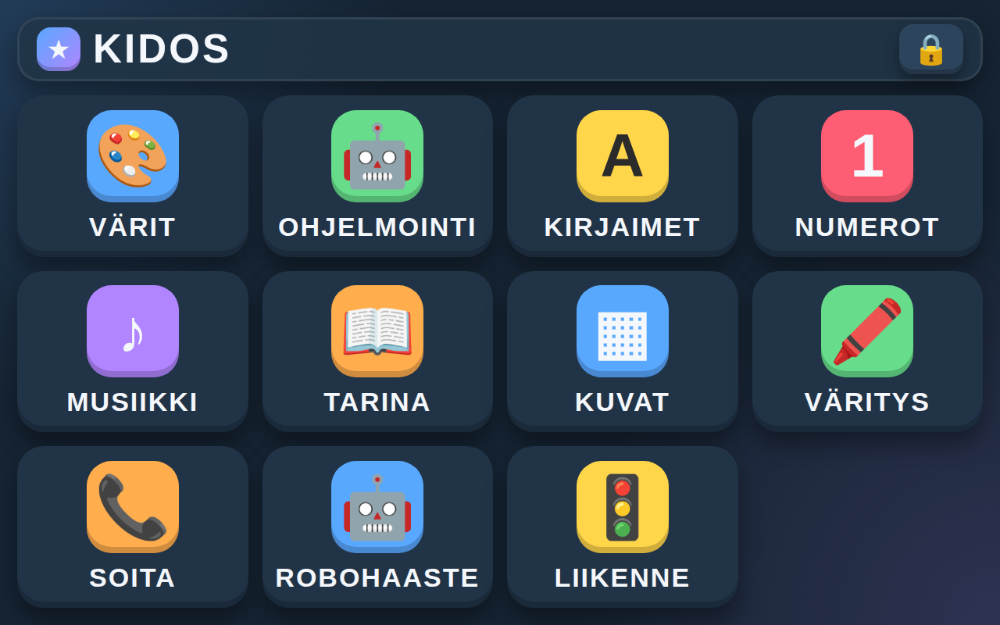

# KidOS



**KidOS** on selainpohjainen "leikkikäyttöjärjestelmä" 3–5-vuotiaille lapsille.

Tarkoitus ei ole tehdä oikeaa käyttöjärjestelmää, vaan turvallinen, koko ruudun täyttävä leikkiympäristö, jossa lapsi voi harjoitella tietokoneen käyttöä, hiirtä, näppäimistöä, värejä, numeroita, kirjaimia, ääniä, yksinkertaista ohjelmointiajattelua ja liikennesääntöjä — ilman että hän pääsee vahingossa muualle koneelle.

KidOS on tehty tarkoituksella kevyeksi: pelkkää HTML/CSS/JavaScriptiä, ei palvelinta, ei tietokantaa, ei build-vaihetta eikä ulkoisia riippuvuuksia. Se toimii suoraan selaimessa millä tahansa koneella, mutta on suunniteltu erityisesti pyörimään Raspberry Pi:llä täysruutuisena lapsen omana pikkukoneena.

## Sovellukset

Työpöydältä avautuvat sovellukset:

- **VÄRIT** (`apps/colors/`) – väripeli
- **OHJELMOINTI** (`apps/programming/`) – kevyt robottipulma (4×4-ruudukko)
- **KIRJAIMET** (`apps/letters/`) – sanan tavaaminen
- **NUMEROT** (`apps/numbers/`) – lukumäärän tunnistus
- **MUSIIKKI** (`apps/music/`) – Simon-says-tyylinen soittopeli, toimii myös näppäimistöllä (D F G H J K)
- **TARINA** (`apps/story/`) – valintapohjainen kuvatarina
- **KUVAT** (`apps/photos/`) – symbolipohjainen kuvagalleria
- **VÄRITYS** (`apps/coloring/`) – väritysohjelma
- **SOITA** (`apps/call/`) – turvallinen Google Meet -linkin avaus aikuisen avulla
- **ROBOHAASTE** (`apps/robot-challenge/`) – laajempi robottipulma ja oma kenttäeditori
- **LIIKENNE** (`apps/traffic/`) – robotti ohjataan nuolinäppäimillä (tai ruudun ohjaimilla) pienessä kaupungissa: jalkakäytävät, kaksikaistaiset autotiet, suojatiet liikennevaloineen, puistoja ja rakennuksia. Kaupungissa asuu kahdeksan eläintä, joilla on kiinteä toive (esim. 🐰 haluaa 🥕); eläimet arvotaan uuteen paikkaan joka pelikerta niin, että ne eivät ole liian lähekkäin

Näiden lisäksi:

- **LUKKO** (`apps/lock/`) – KidOSin symbolipohjainen lukitusruutu, avataan lukituspainikkeesta
- `apps/drawing/` – kevyt piirtoprototyyppi, ei toistaiseksi työpöydällä

Tarkempi suunnitelma, tehdyt korjaukset ja tunnetut puutteet: ks. [`KidOS-masterplan-2026-09-18.md`](./KidOS-masterplan-2026-09-18.md).

## Asennus Raspberry Pi:lle (täysruutuinen käynnistin)

1. **Lataa projekti Pi:lle.** Joko GitHubin "Code → Download ZIP" -napista, tai `git clone`-komennolla:
   ```bash
   git clone https://github.com/McTre/KidOS.git
   ```
2. **Pura tiedosto**, jos latasit ZIP-paketin, haluamaasi kansioon Pi:llä — esimerkiksi:
   ```bash
   unzip KidOS-main.zip -d /home/pi/
   mv /home/pi/KidOS-main /home/pi/KidOS
   ```
3. **Varmista, että Chromium on asennettuna** (se on mukana oletuksena Raspberry Pi OS:ssä).
4. **Tarkista `KidOS.desktop`-tiedoston polut.** Jos projekti ei ole juuri kansiossa `/home/pi/KidOS`, muokkaa tiedoston `Exec=`- ja `Icon=`-rivit vastaamaan oikeaa polkua.
5. **Kopioi `KidOS.desktop`** työpöydälle (`~/Desktop/`) tai kansioon `~/.local/share/applications/`.
6. **Kaksoisklikkaa KidOS-kuvaketta.** Käynnistin (`launch-kidos.sh`) avaa Chromiumin kioskitilassa suoraan täysruutuun, ilman osoiteriviä tai muita selaimen elementtejä, ja estää näytönsäästäjän aktivoitumisen kesken leikin.

`launch-kidos.sh` etsii automaattisesti `chromium-browser`- tai `chromium`-komennon, joten se toimii Raspberry Pi OS:n eri versioilla.

## Kokeilu tavallisella tietokoneella

Erillistä asennusta ei tarvita: avaa `index.html`-tiedosto suoraan selaimessa millä tahansa Linux-, Windows- tai macOS-koneella.

## Rakenne

```text
KidOS/
├── index.html          KidOS-työpöytä
├── style.css           työpöydän ulkoasu
├── script.js           sovellusten avaaminen, sulkeminen ja lukitus
├── launch-kidos.sh      täysruutukäynnistin (Raspberry Pi)
├── KidOS.desktop        työpöytäkuvake täysruutukäynnistimelle
├── assets/              yhteiset visuaaliset resurssit (kursori, ikoni)
├── shared/
│   └── audio.js         kaikkien sovellusten ja työpöydän yhteiset äänet
└── apps/                yksittäiset sovellukset, jokaisella oma index.html/style.css/js
```

## Kehitys

Projektin pitää pysyä yksinkertaisena: ei raskasta frameworkia, ei build-järjestelmää. Jokainen sovellus saa oman kansionsa `apps/`-kansion alle, ja yhteiset asiat pidetään `shared/`- tai `assets/`-kansiossa.
